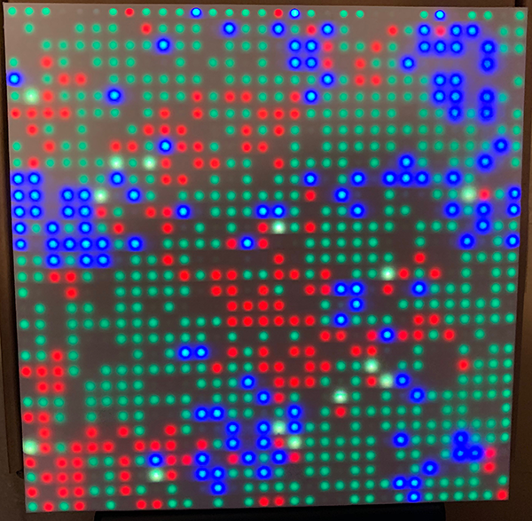

# SimpleLifeGrid
Life Grid for 32x32 LED array using the C example code

Combined inner loop of PanelLifeProject.c and the framework of c-example.c to see if I could drive the LED panel from a Raspberry Pi with an Adafruit HAT in a very simple way. It works!

# Programming Logic

Every Pixel on the grid can be a Plant, Species 1, Species 2, or nothing. Species can overlap with each other, and with plants.

These are the parameters that can be tweaked:

PLANTS_LIFE_EXPECTANCY 255
PLANTS_RANDOM_BORN_CHANCES 1000
PLANTS_RANDOM_NEARBORN_CHANCES 100
PLANTS_ENERGY_BASE_PER_CYCLE 10

These parameters are set separately for Species 1 and Species 2:

SPECIES_LIFE_EXPECTANCY 200
SPECIES_RANDOM_BORN_CHANCES 10000
SPECIES_RANDOM_NEARBORN_CHANCES 100
SPECIES_ENERGY_BASE 10
SPECIES_ENERGY_NEEDED_PER_CYCLE 2
SPECIES_MAX_ENERGY_RECOLECTED_PER_CYCLE 10
SPECIES_ENERGY_TO_REPLICATE 15

Here is the basic programming logic for species and plants:

For every pixel:
  count the number of neighbors for plants, species 1 and species 2

Plants:
 if the current pixel is past life expectancy: die (set energy and age to zero)
 if you're under life expectancy but out of energy: die
 if you're still alive after that: increment age, add energy

 if your age is zero, and there are no plant neighbors, try to spawn a plant.
 if your age is zero, and there are plant neighbors, try to spawn a plant (10x higher success rate)

 
Species:
 If you exist, try to eat:
   If the plant at your spot has energy, and it has more energy than you consume,
      take an aliquot for yourself, subtract that much energy from the plant. 
   If the plant doesn't have as much energy as you consume per cycle, take the energy it does have, and set it's energy to zero.

Age yourself by one cycle.
Decrease your energy by one cycle.

Try to replicate:
  If you have enough energy to replicate:
	Look all around yourself for open (non-you) positions.
        If one is open, if chance allows, pick one randomly and spawn.

If you've reached your life expectancy, die.

Repeat this same logic for Species 2.

After all this:
  color spots with with Species 1 Red
  color spots with Species 2 Blue
  color spots with both species yellow
  color spots with plants green
  color spots with nothing black
